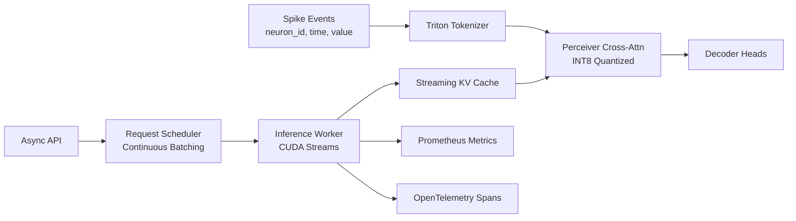

# Cortex-Engine

> **Real-time inference infrastructure for transformer-based neural decoders.**
> Custom Triton kernels. FSDP training. Continuous batching. Sub-30ms p99 latency on a single A100.

[](#)
[](#)
[](#)
[](#)
[](#)

---

## What This Is

A complete training and inference stack for transformer neural decoders, engineered for production deployment. Three optimized model sizes, custom GPU kernels, INT8 quantization with calibration, a continuous-batching inference engine, and a full observability stack. Built on real motor cortex data from the Neural Latents Benchmark.

## Hero Numbers

| Metric                | Baseline (PyTorch eager) | Cortex-Engine | Improvement |
|-----------------------|--------------------------|---------------|-------------|
| p50 latency           | TBD (Phase 3)            | TBD           | target <15 ms p99 |
| p99 latency           | TBD (Phase 3)            | TBD           | target <30 ms     |
| Throughput (req/s)    | TBD (Phase 3)            | TBD           | target 5×         |
| Peak memory (GB)      | TBD (Phase 2)            | TBD           | target 4× via INT8|
| Decoding R² (velocity)| Wiener −0.003 · GRU −0.006 · Transformer −0.013 | Cortex-S −0.0002 | Phase 1 infra run; see note |

> **Phase 1 note:** All R² values are from sliding-window evaluation over the full MC_Maze continuous recording (115 min, 85% rest). Published NLB numbers (Wiener R² ≈ 0.40) use trial-aligned evaluation. Trial-aligned evaluation is scoped for Phase 2. See [`benchmarks/training/results.md`](benchmarks/training/results.md) for full explanation.
>
> Latency/throughput numbers are Phase 2–3 deliverables. See `benchmarks/` for raw data and reproduction scripts.

## Architecture



## Quickstart

```bash
# Install
make dev-install

# Train Cortex-S (smallest size that beats baselines)
make train-s

# Run inference server
make serve

# Or bring up the full stack with observability
make docker-up
# Grafana at localhost:3000, Prometheus at localhost:9090, API at localhost:8080
```

## Engineering Stack

| Layer | Tools |
|-------|-------|
| **Training** | PyTorch, FSDP2, Hydra, W&B, custom data sharding |
| **Optimization** | Triton, INT8 quantization with calibration, profiling-driven design |
| **Serving** | FastAPI, Pydantic, async/await, continuous batching scheduler |
| **Observability** | Prometheus, Grafana, OpenTelemetry, structlog |
| **Operations** | Docker multi-stage, docker-compose, Helm chart, k6 load tests |
| **Quality** | mypy --strict, ruff, black, pre-commit, pytest, hypothesis |

## Project Structure

```
cortex-engine/
├── cortex/                 # Main package
│   ├── models/             # Model architecture (tokenizer, perceiver, decoders)
│   ├── kernels/            # Triton kernels with PyTorch references
│   ├── quantization/       # Calibration and INT8 weight handling
│   ├── training/           # FSDP training loop, data loaders, baselines
│   ├── serve/              # FastAPI app, scheduler, inference worker
│   ├── cache/              # Streaming KV cache (paged attention pattern)
│   ├── data/               # NLB dataset loaders
│   └── utils/              # Logging, profiling helpers
├── configs/                # Hydra configs (model/training/data/runtime/serving)
├── ops/                    # Docker, k6, Grafana dashboards, Helm
├── tests/                  # Unit + integration tests
├── benchmarks/             # Phase-by-phase benchmark scripts and reports
├── docs/                   # Long-form writeup, runbook, SLOs
└── scripts/                # One-off utilities
```

## Documentation

- **Engineering writeup:** [`docs/writeup.md`](docs/writeup.md) — full postmortem of design decisions
- **Runbook:** [`docs/runbook.md`](docs/runbook.md) — operational procedures
- **SLOs:** [`docs/slo.md`](docs/slo.md) — service level objectives and burn analysis
- **Project plan:** [`docs/PROJECT_PLAN.md`](docs/PROJECT_PLAN.md) — extended phase details
- **Build instructions for Claude Code:** [`CLAUDE.md`](CLAUDE.md)

## Why Neural Decoding

The model decodes motor cortex population activity into hand kinematics, using public BCI data from the [Neural Latents Benchmark](https://neurallatents.github.io/). The streaming nature of biological signals and the hard latency budgets of real BCI deployment make this a genuine systems engineering problem, not a contrived benchmark. Every optimization in this repo is in service of running the model fast enough to be useful.

The infrastructure patterns transfer directly to LLM serving: continuous batching, paged KV cache, FSDP, custom kernels.

## License

MIT
